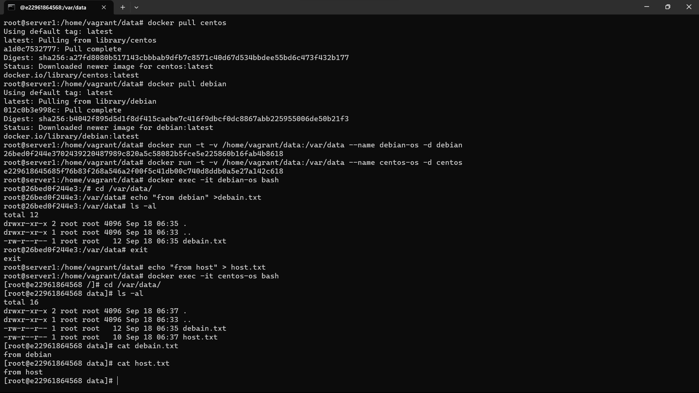

Задача 1

Сценарий выполения задачи:

	создайте свой репозиторий на https://hub.docker.com;
	выберете любой образ, который содержит веб-сервер Nginx;
	создайте свой fork образа;
	реализуйте функциональность: запуск веб-сервера в фоне с индекс-страницей, содержащей HTML-код ниже:

<html>
<head>
Hey, Netology
</head>
<body>
<h1>I’m DevOps Engineer!</h1>
</body>
</html>

Опубликуйте созданный форк в своем репозитории и предоставьте ответ в виде ссылки на https://hub.docker.com/username_repo.

Ответ:

1.Загружаем образ nginx командой $docker pull nginx

2.Создаём dockerfile $touch dockerfile и прописываем в нём:

FROM nginx

RUN echo '<html><head>Hey, Netology</head><body><h1>I am DevOps Engineer!</h1></body></html>' > /usr/share/nginx/html/index.html

3.Собираем свой образ nginx $docker build -f dockerfile -t vitaliyw88/nginx:1.0 .

4.Запускаем образ командой $docker run -it --rm -d -p 20011:80 --name wed vitaliyw88/nginx:1.0

5.Публикуем созданный образ в Docker Hub 

$ docker login

$ docker tag vitaliyw88/nginx:1.0 vitaliyw88/nginx

$ docker push vitaliyw88/nginx

Ссылка на репозиторий:

https://hub.docker.com/r/vitaliyw88/nginx/tags

Задача 2

Посмотрите на сценарий ниже и ответьте на вопрос: "Подходит ли в этом сценарии использование Docker контейнеров или лучше подойдет виртуальная машина, физическая машина? Может быть возможны разные варианты?"

Детально опишите и обоснуйте свой выбор.

--

Сценарий:

	Высоконагруженное монолитное java веб-приложение;
	Nodejs веб-приложение;
	Мобильное приложение c версиями для Android и iOS;
	Шина данных на базе Apache Kafka;
	Elasticsearch кластер для реализации логирования продуктивного веб-приложения - три ноды elasticsearch, два logstash и две ноды kibana;
	Мониторинг-стек на базе Prometheus и Grafana;
	MongoDB, как основное хранилище данных для java-приложения;
	Gitlab сервер для реализации CI/CD процессов и приватный (закрытый) Docker Registry.

Ответ:

Высоконагруженное монолитное Java веб-приложение - поскольку есть условие монолитности приложения, использование Java в Docker контейнере не подходит. В этом случае, думаю, надо сделать акцент на оптимальную утилизацию ресурсов. Больше подойдет отдельный физический сервер;

Nodejs веб-приложение - В этом сценарии docker подойдет. С одной стороны он дает возможность развернуть среду со всеми зависимостями, а с другой обеспечит необходимую масштабируемость;

Мобильное приложение c версиями для Android и iOS - если брать серверная часть приложения, то можно использовать docker из-за масштабируемости и возможность развернуть среду со всеми зависимостями. Но для запуска клиентской части приложения подойдет не всегда, т.к. в контейнерах нет UI или иного графического вывода;

Шина данных на базе Apache Kafka - можно использовать как docker так и виртуальную машину. Но при отказе хоста на котором крутится docker шина перестанет работать. В случае виртуальных машин или физических серверов отказоустойчивость в целом выше, если использовать несколько физически разных хостов. Кроме того, при большой нагрузке не очень понятно, справится ли решение на docker с нагрузкой;

Elasticsearch кластер для реализации логирования продуктивного веб-приложения - три ноды elasticsearch, два logstash и две ноды kibana - Elasticsearch рекомендуется устанавливать на выделенный физический сервер, чтобы не было конкуренции за ресурсы. Logstash и Kibana могут быть установлены в Docker, т.к. к ним нет таких требований. В целом же при невысокой критичности данного (всего лишь сбор и анализ логов), все продукты можно развернуть в Docker для более удобного разворачивания, обновления версий, настройки сетевых соединений;

Мониторинг-стек на базе Prometheus и Grafana - можно устанавливать на физические или виртуальные машины, но гораздо удобнее запускать из Docker образов. Сами системы довольно легковесные, но им может понадобиться много пространства на жестком диске для сбора и хранения метрик. Параметры приложений и подключаемые директории, а также время хранения метрик можно удобно описать в docker-compose файлах. Также используя docker compose можно легко менять параметры Prometheus и Grafana либо масштабировать их;

MongoDB, как основное хранилище данных для java-приложения - для базы MongoDB данных лучше использовать кластер (из виртуальных или физический машини) или кластер построенный на docker, т.к. эта база даннах поддерживает горизонтальное масштабирование, что важно если используется одна база для большого кол-ва приложений. Единственный момент - т.к. мы говорим, про базу данных, то необходимо предусмотреть резервирование в случае выхода из строя хоста, на котором расположены виртуальные машины или docker - хоста;

Gitlab-сервер для реализации CI/CD-процессов и приватный (закрытый) Docker Registry - возможна установка и запуск этих систем как на виртуальных и физических машинах, так и на Docker контейнерах. Мне кажется более безопасным способом использование виртуальных машин с созданием резервных копий по расписанию и хранению этих копий в течении определенного времени, т.к. Git и Docker репозитории могут содержать очень важные данные, например, исходные коды приложений. Также приватный Docker Registry не стоит выкладывать в публичный Docker Hub или куда-то еще в интернет.

Задача 3

	Запустите первый контейнер из образа centos c любым тэгом в фоновом режиме, подключив папку /data из текущей рабочей директории на хостовой машине в /data контейнера;
	Запустите второй контейнер из образа debian в фоновом режиме, подключив папку /data из текущей рабочей директории на хостовой машине в /data контейнера;
	Подключитесь к первому контейнеру с помощью docker exec и создайте текстовый файл любого содержания в /data;
	Добавьте еще один файл в папку /data на хостовой машине;
	Подключитесь во второй контейнер и отобразите листинг и содержание файлов в /data контейнера.

Ответ:

1. Скачаем образы:

$ docker pull centos

$ docker pull debian

2. Запустим контейнеры:

$ docker run -t -v /home/vagrant/data:/var/data --name debian-os -d debian

$ docker run -t -v /home/vagrant/data:/var/data --name centos-os -d centos

3. Заходим в контейнер Debian и создадим файл в директории /var/data/

$ docker exec -it debian-os bash

echo "from debian" >debain.txt

4. Создадим еще один файл в директории /home/vagrant/data с хостовой машины

echo "from host" > host.txt

5. Зайдем на вторую машину с Centos и посмотрим содержимое обоих файлов в директории /var/data/

$ docker exec -it centos-os bash

Файлы одинаковые как в контейнерах, так и на хостовой машине. Следовательно подключение директории хостовой машины к контейнеру выполнено успешно, и хостовая директория может быть общей для нескольких контейнеров.

