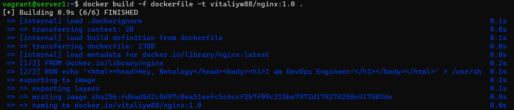

Задача 1

Сценарий выполения задачи:

	создайте свой репозиторий на https://hub.docker.com;
	выберете любой образ, который содержит веб-сервер Nginx;
	создайте свой fork образа;
	реализуйте функциональность: запуск веб-сервера в фоне с индекс-страницей, содержащей HTML-код ниже:

<html>
<head>
Hey, Netology
</head>
<body>
<h1>I’m DevOps Engineer!</h1>
</body>
</html>

Опубликуйте созданный форк в своем репозитории и предоставьте ответ в виде ссылки на https://hub.docker.com/username_repo.

Ответ:

1.Загружаем образ nginx командой $docker pull nginx
2.Создаём dockerfile $touch dockerfile и прописываем в нём:
FROM nginx
RUN echo '<html><head>Hey, Netology</head><body><h1>I am DevOps Engineer!</h1></body></html>' > /usr/share/nginx/html/index.html
3.Собираем свой образ nginx $docker build -f dockerfile -t vitaliyw88/nginx:1.0 .

4.Запускаем образ командой $docker run -it --rm -d -p 20011:80 --name wed vitaliyw88/nginx:1.0

5.Публикуем созданный образ в Docker Hub 
$ docker login
$ docker tag vitaliyw88/nginx:1.0 vitaliyw88/nginx
$ docker push vitaliyw88/nginx
Ссылка на репозиторий:
https://hub.docker.com/r/vitaliyw88/nginx/tags

Задача 2

Посмотрите на сценарий ниже и ответьте на вопрос: "Подходит ли в этом сценарии использование Docker контейнеров или лучше подойдет виртуальная машина, физическая машина? Может быть возможны разные варианты?"

Детально опишите и обоснуйте свой выбор.

--

Сценарий:

	Высоконагруженное монолитное java веб-приложение;
	Nodejs веб-приложение;
	Мобильное приложение c версиями для Android и iOS;
	Шина данных на базе Apache Kafka;
	Elasticsearch кластер для реализации логирования продуктивного веб-приложения - три ноды elasticsearch, два logstash и две ноды kibana;
	Мониторинг-стек на базе Prometheus и Grafana;
	MongoDB, как основное хранилище данных для java-приложения;
	Gitlab сервер для реализации CI/CD процессов и приватный (закрытый) Docker Registry.

Задача 3

	Запустите первый контейнер из образа centos c любым тэгом в фоновом режиме, подключив папку /data из текущей рабочей директории на хостовой машине в /data контейнера;
	Запустите второй контейнер из образа debian в фоновом режиме, подключив папку /data из текущей рабочей директории на хостовой машине в /data контейнера;
	Подключитесь к первому контейнеру с помощью docker exec и создайте текстовый файл любого содержания в /data;
	Добавьте еще один файл в папку /data на хостовой машине;
	Подключитесь во второй контейнер и отобразите листинг и содержание файлов в /data контейнера.