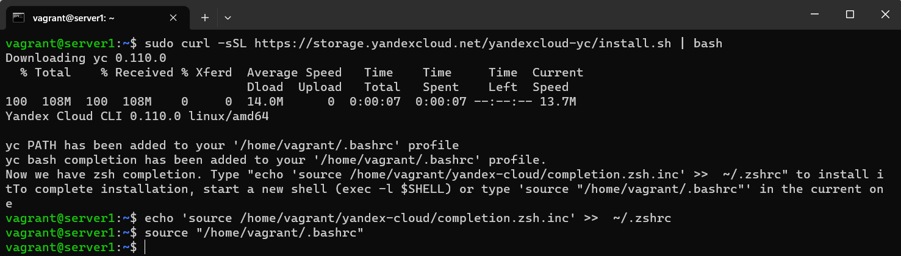
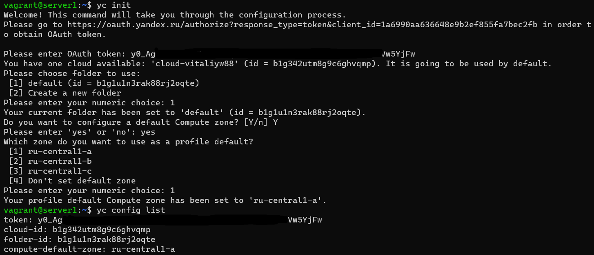
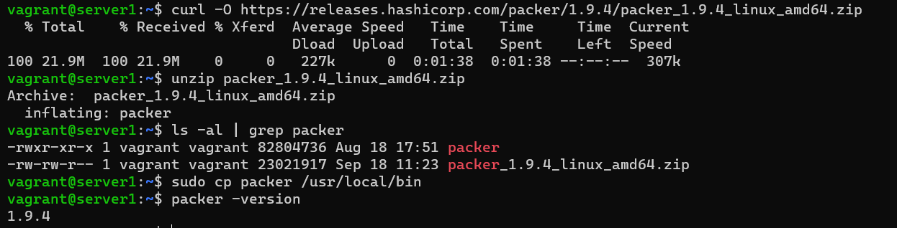
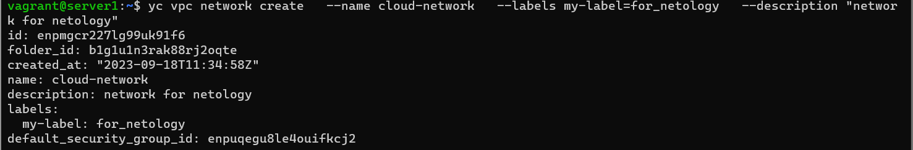
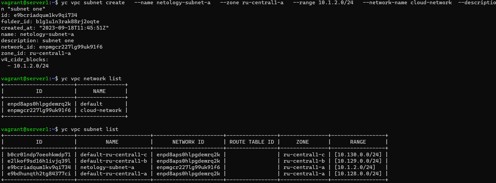
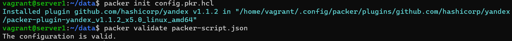
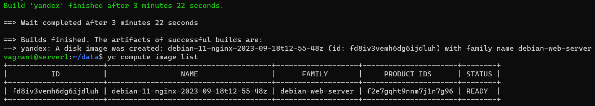
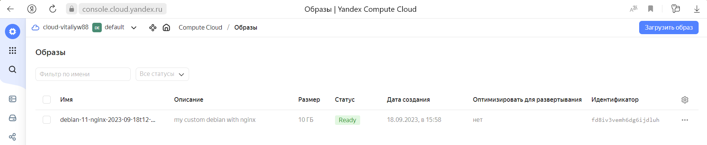

Задача 1
Создайте собственный образ любой операционной системы (например, debian-11) с помощью Packer (инструкция для установки плагина yandex-cloud).

Чтобы получить зачёт, вам нужно предоставить скриншот страницы с созданным образом из личного кабинета YandexCloud.

Ответ:

1. установим клиент yandex облака

$ sudo curl -sSL https://storage.yandexcloud.net/yandexcloud-yc/install.sh | bash

$ echo 'source /home/vagrant/yandex-cloud/completion.zsh.inc' >>  ~/.zshrc

$ source "/home/vagrant/.bashrc"

2. настраиваем конфигурацию облака

$ yc init

$ yc config list

3.Установливаем packer

$ curl -O https://releases.hashicorp.com/packer/1.9.4/packer_1.9.4_linux_amd64.zip

$ unzip packer_1.9.4_linux_amd64.zip

$ sudo cp packer /usr/local/bin

$ packer -version

4. создаем сеть

$ yc vpc network create   --name cloud-network   --labels my-label=for_netology   --description "network for netology"

5. создаем подсеть

$ yc vpc subnet create   --name netology-subnet-a   --zone ru-central1-a   --range 10.1.2.0/24   --network-name cloud-network  --description "subnet one"

6. Для создания образа операционной системы создал файл packer-script.json с параметрами из инструкции cloud.yandex.ru. И проверил его на наличие ошибок командой $ packer validate packer-script.json

{
  "builders": [
    {
      "type":      "yandex",
      "token":     "-",
      "folder_id": "b1g1u1n3rak88rj2oqte",
      "zone":      "ru-central1-a",

      "image_name":        "debian-11-nginx-{{isotime | clean_resource_name}}",
      "image_family":      "debian-web-server",
      "image_description": "my custom debian with nginx",

      "source_image_family": "debian-11",
      "subnet_id":           "e9bcriadqum1kv9qi734",
      "use_ipv4_nat":        true,
      "disk_type":           "network-ssd",
      "ssh_username":        "debian"
    }
  ],
  "provisioners": [
    {
      "type": "shell",
      "inline": [
        "echo 'updating APT'",
        "sudo apt-get update -y",
        "sudo apt-get install -y nginx",
        "sudo su -",
        "sudo systemctl enable nginx.service",
        "curl localhost"
      ]
    }
  ]
}

7.Запускаем сборку образа и проверяем результат

$ packer build packer-script.json

$ yc compute image list

Задача 2

2.1. Создайте вашу первую виртуальную машину в YandexCloud с помощью web-интерфейса YandexCloud.

Чтобы получить зачёт, вам нужно предоставить вывод команды terraform apply и страницы свойств, созданной ВМ из личного кабинета YandexCloud.

Задача 3

С помощью Ansible и Docker Compose разверните на виртуальной машине из предыдущего задания систему мониторинга на основе Prometheus/Grafana. Используйте Ansible-код в директории (src/ansible).

Чтобы получить зачёт, вам нужно предоставить вывод команды "docker ps" , все контейнеры, описанные в docker-compose, должны быть в статусе "Up".

Задача 4
Откройте веб-браузер, зайдите на страницу http://<внешний_ip_адрес_вашей_ВМ>:3000.
Используйте для авторизации логин и пароль из .env-file.
Изучите доступный интерфейс, найдите в интерфейсе автоматически созданные docker-compose-панели с графиками(dashboards).
Подождите 5-10 минут, чтобы система мониторинга успела накопить данные.
Чтобы получить зачёт, предоставьте:

скриншот работающего веб-интерфейса Grafana с текущими метриками.