Задача 1

Используя Docker, поднимите инстанс PostgreSQL (версию 12) c 2 volume, в который будут складываться данные БД и бэкапы.

Приведите получившуюся команду или docker-compose-манифест.

Ответ:

1.Cоздадим необходимы папки:

$ mkdir /home/vagrant/postgresql
$ mkdir /home/vagrant/postgresql/data
$ mkdir /home/vagrant/postgresql/backup

2.Cоздадим docker-compose.yml файл:

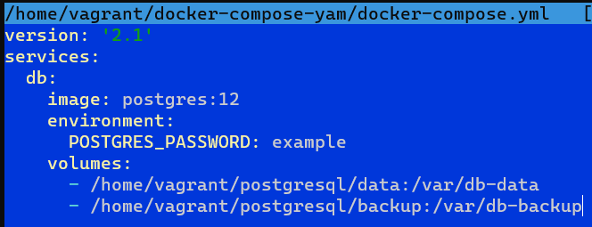

3.Проверим что сервис собирается и стартует:

$ sudo docker compose build

$ sudo docker compose create

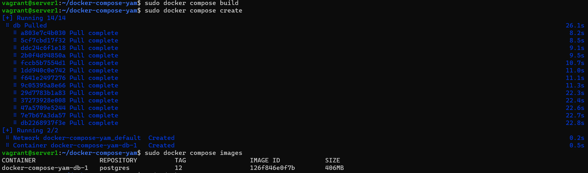

4. Запустим контейнеры:

$ sudo docker compose up -d

5. Смотрим что контейнер запустился и работает:

$ sudo docker compose ps

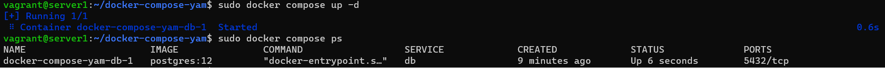

Задача 2

В БД из задачи 1:

создайте пользователя test-admin-user и БД test_db;

в БД test_db создайте таблицу orders и clients (спeцификация таблиц ниже);

предоставьте привилегии на все операции пользователю test-admin-user на таблицы БД test_db;

создайте пользователя test-simple-user;

предоставьте пользователю test-simple-user права на SELECT/INSERT/UPDATE/DELETE этих таблиц БД test_db.

Таблица orders:

id (serial primary key);
наименование (string);
цена (integer).
Таблица clients:

id (serial primary key);
фамилия (string);
страна проживания (string, index);
заказ (foreign key orders).
Приведите:

итоговый список БД после выполнения пунктов выше;
описание таблиц (describe);
SQL-запрос для выдачи списка пользователей с правами над таблицами test_db;
список пользователей с правами над таблицами test_db.

Ответ:

1.Заходим в контейнер и создаём пользователя test-admin-user и БД test_db:

$ sudo docker exec -it docker-compose-yam-db-1 bash

chown postgres:postgres /var/db-data/

psql -U postgres

CREATE USER "test-admin-user";

CREATE TABLESPACE "test-tablespace" OWNER CURRENT_USER
LOCATION '/var/db-data'
;

CREATE DATABASE "test_db" WITH TABLESPACE = "test-tablespace";

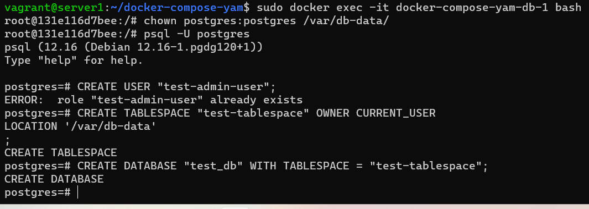

2.В БД test_db создайте таблицу orders и clients:

\connect test_db

CREATE TABLE orders(
    id          serial primary key,
    title       text NOT NULL,
    price       integer
);

CREATE TABLE clients(
    id            serial primary key,
    surname       text NOT NULL,
    from_country_id  integer NOT NULL,
    from_country_name text NOT NULL,
    order_id      integer REFERENCES orders
);

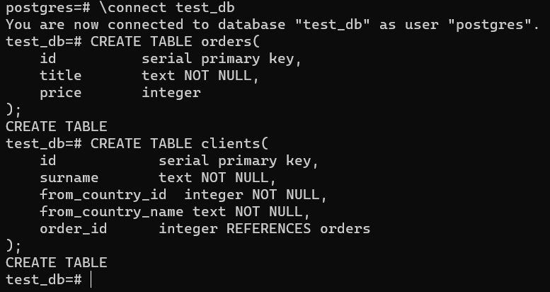

3.Предоставьте привилегии на все операции пользователю test-admin-user на таблицы БД test_db:

GRANT ALL PRIVILEGES ON DATABASE test_db to "test-admin-user";

GRANT ALL PRIVILEGES ON TABLE orders, clients  to "test-admin-user";

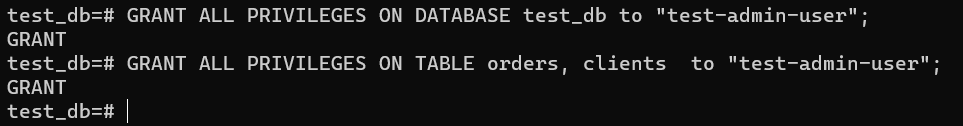

4.Создайте пользователя test-simple-user:

CREATE USER "test-simple-user";

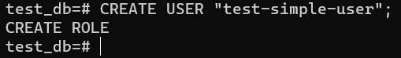

5.Предоставьте пользователю test-simple-user права на SELECT/INSERT/UPDATE/DELETE данных таблиц БД test_db:

GRANT SELECT, INSERT, UPDATE, DELETE ON TABLE orders, clients  to "test-simple-user";

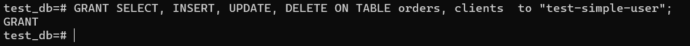

6.Итоговый список БД после выполнения пунктов выше:

\list

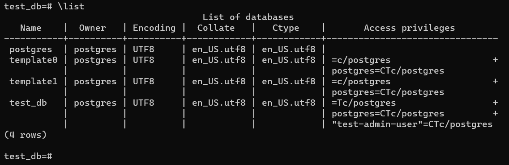

7.Описание таблиц (describe):

\d orders

\d clients

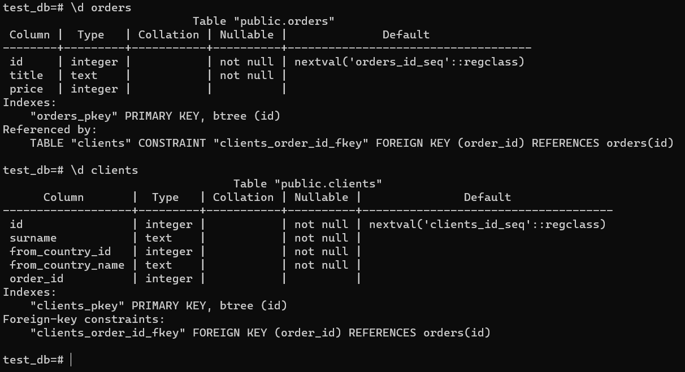

8.SQL-запрос для выдачи списка пользователей с правами над таблицами test_db:

SELECT distinct grantee
FROM information_schema.role_table_grants
WHERE table_name in ('orders','clients');

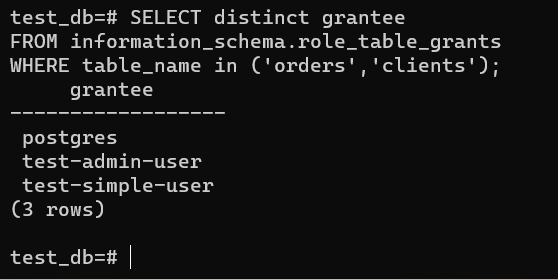

9.Список пользователей с правами над таблицами test_db:

SELECT grantee, table_name, privilege_type
FROM information_schema.role_table_grants
WHERE table_name in ('orders','clients');

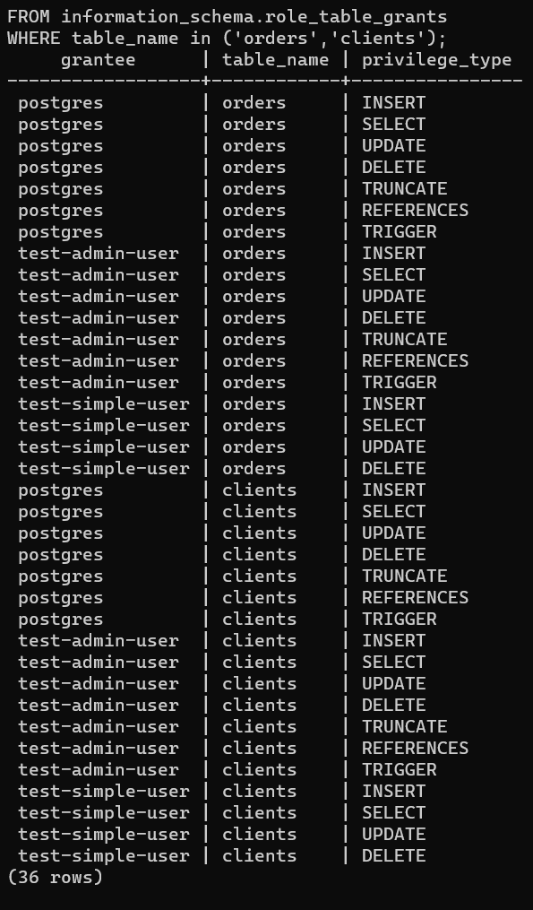

Задача 3

Используя SQL-синтаксис, наполните таблицы следующими тестовыми данными:

Таблица orders

| Наименование | цена |
| --- | --- |
| Шоколад | 10 |
| Принтер | 3000 |
| Книга | 500 |
| Монитор | 7000 |
| Гитара | 4000 |

Таблица clients

| ФИО | Страна проживания |
| --- | --- |
| Иванов Иван Иванович | USA |
| Петров Петр Петрович | Canada |
| Иоганн Себастьян Бах | Japan |
| Ронни Джеймс Дио | Russia |
| Ritchie Blackmore | Russia |

Используя SQL-синтаксис:

вычислите количество записей для каждой таблицы.
Приведите в ответе:

- запросы,
- результаты их выполнения.

Ответ:

1.Таблица orders;

insert into orders(title, price) VALUES ('Шоколад', 10);

insert into orders(title, price) VALUES ('Принтер', 3000);

insert into orders(title, price) VALUES ('Книга', 500);

insert into orders(title, price) VALUES ('Монитор', 7000);

insert into orders(title, price) VALUES ('Гитара',4000);

select * from orders;

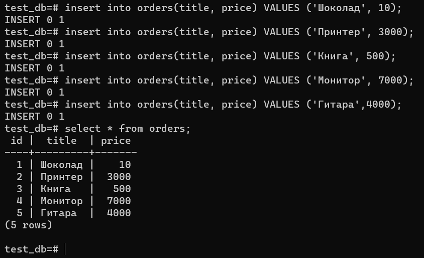

2.Таблица clients:

insert into clients (surname, from_country_id, from_country_name) VALUES ('Иванов Иван Иванович', 1, 'USA');

insert into clients (surname, from_country_id, from_country_name) VALUES ('Петров Петр Петрович', 2, 'Canada');

insert into clients (surname, from_country_id, from_country_name) VALUES ('Иоганн Себастьян Бах', 3, 'Japan');

insert into clients (surname, from_country_id, from_country_name) VALUES ('Ронни Джеймс Дио', 4, 'Russia');

insert into clients (surname, from_country_id, from_country_name) VALUES ('Ritchie Blackmore', 4, 'Russia');

test_db=# select * from clients;

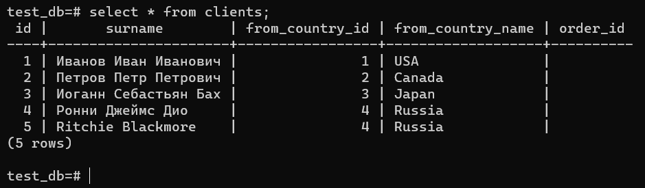

Задача 4

Часть пользователей из таблицы clients решили оформить заказы из таблицы orders.

Используя foreign keys, свяжите записи из таблиц, согласно таблице:

| ФИО | Заказ |
| --- | --- |
| Иванов Иван Иванович | Книга |
| Петров Петр Петрович | Монитор |
| Иоганн Себастьян Бах | Гитара |

Приведите SQL-запросы для выполнения этих операций.

Приведите SQL-запрос для выдачи всех пользователей, которые совершили заказ, а также вывод этого запроса.

Подсказка: используйте директиву UPDATE.

Ответ:

UPDATE clients set order_id = orders.id from orders where orders.title like 'Книга' and clients.surname like 'Иванов Иван Иванович';

UPDATE clients set order_id = orders.id from orders where orders.title like 'Монитор' and clients.surname like 'Петров Петр Петрович';

UPDATE clients set order_id = orders.id from orders where orders.title like 'Гитара' and clients.surname like 'Иоганн Себастьян Бах';

select * from clients;

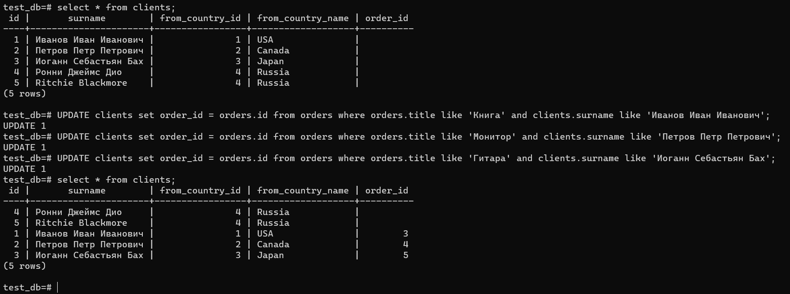

Задача 5

Получите полную информацию по выполнению запроса выдачи всех пользователей из задачи 4 (используя директиву EXPLAIN).

Приведите получившийся результат и объясните, что значат полученные значения.

Ответ:

select clients, order_id, orders.id from clients, orders where orders.title like 'Книга' and clients.surname like 'Иванов Иван Иванович';

explain select clients, order_id, orders.id from clients, orders where orders.title like 'Книга' and clients.surname like 'Иванов Иван Иванович';

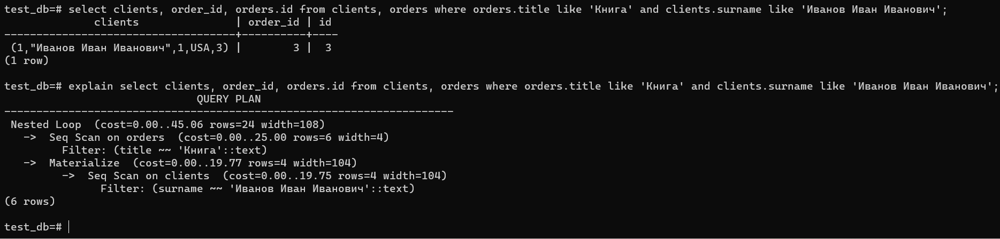

explain показывает шаги формирования ответа с некоторыми параметрами, а именно:

| Параметр | описание |
| --- | --- |
| cost | Абстрактное число указывающее затраченное для выполнения время. Первое число - время затраченное на выполнения запроса первой записи таблицы, второе - всех записей |
| rows | Предпологаемое количество возвращаемых строк |
| width | Предпологаемый средний размер одной строки в байтах |

Задача 6

Создайте бэкап БД test_db и поместите его в volume, предназначенный для бэкапов (см. задачу 1).

Остановите контейнер с PostgreSQL, но не удаляйте volumes.

Поднимите новый пустой контейнер с PostgreSQL.

Восстановите БД test_db в новом контейнере.

Приведите список операций, который вы применяли для бэкапа данных и восстановления.

Ответ:

