Задача 1

Используя Docker, поднимите инстанс MySQL (версию 8). Данные БД сохраните в volume.

Изучите бэкап БД и восстановитесь из него.

Перейдите в управляющую консоль mysql внутри контейнера.

Используя команду \h, получите список управляющих команд.

Найдите команду для выдачи статуса БД и приведите в ответе из её вывода версию сервера БД.

Подключитесь к восстановленной БД и получите список таблиц из этой БД.

Приведите в ответе количество записей с price > 300.

В следующих заданиях мы будем продолжать работу с этим контейнером.

Ответ:

1.Создадим docker-compose файл

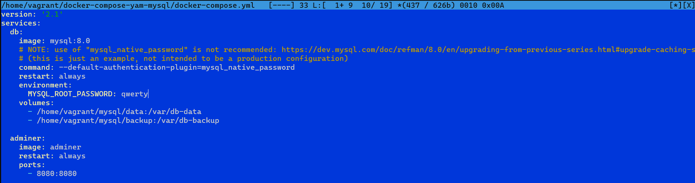

2.Передадим дамп базы и соберем сервис

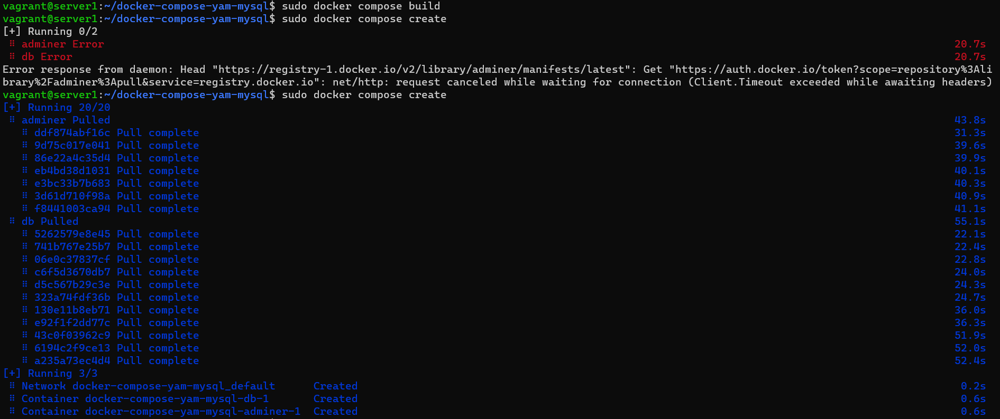

3.Запустим серви, зайдем в контейнер и выполним задание

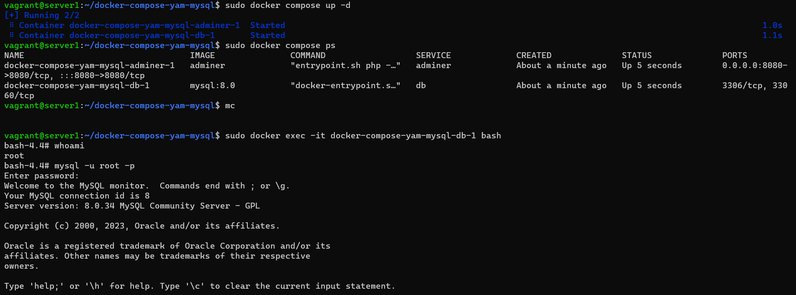

    $ sudo docker exec -it docker-compose-yam-mysql-db-1 bash

    mysql -u root -p

4.Вывод help

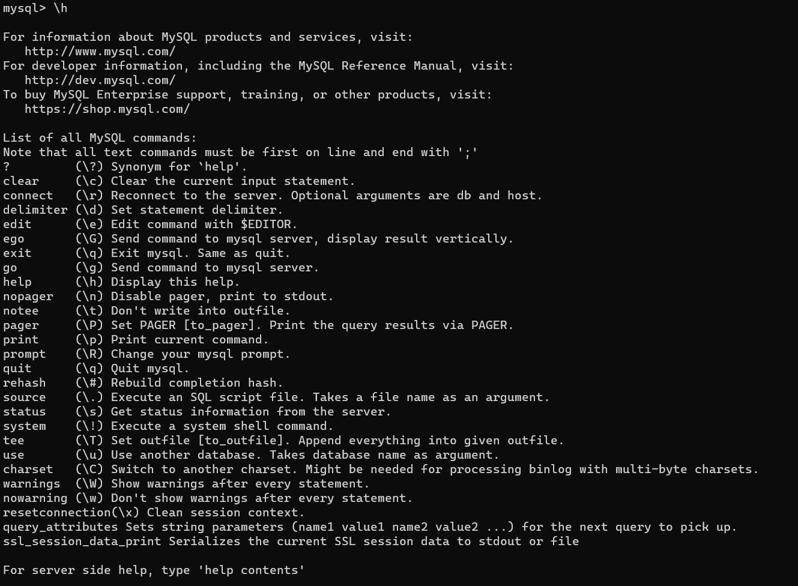

5.Команда status

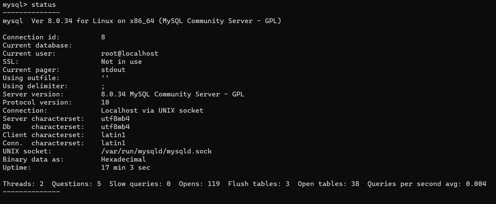

6.Создадим базу данных test_db, загрузим dump базы и подключимся к ней.

    create database test_db;

    mysql test_db < test_dump.sql -u root -p

    mysql -u root -p

    connect test_db

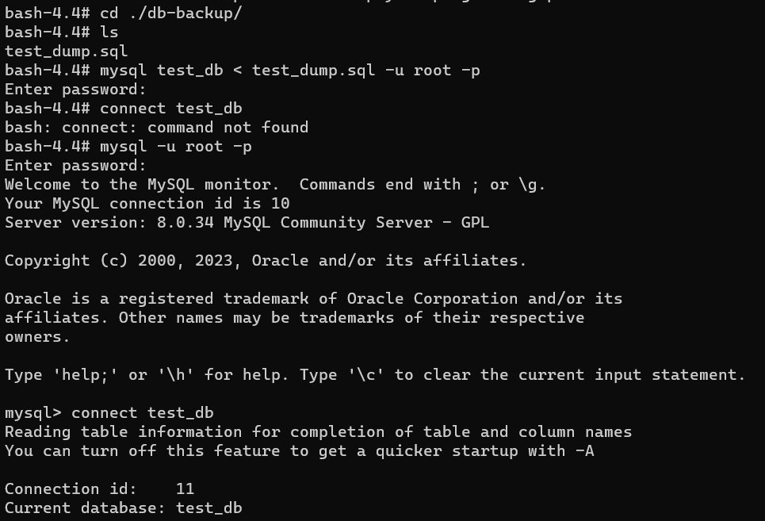

7.Получите список таблиц из этой БД и количество записей с price > 300

    SHOW DATABASES;

    SHOW tables;

    select * from orders where price > 300;

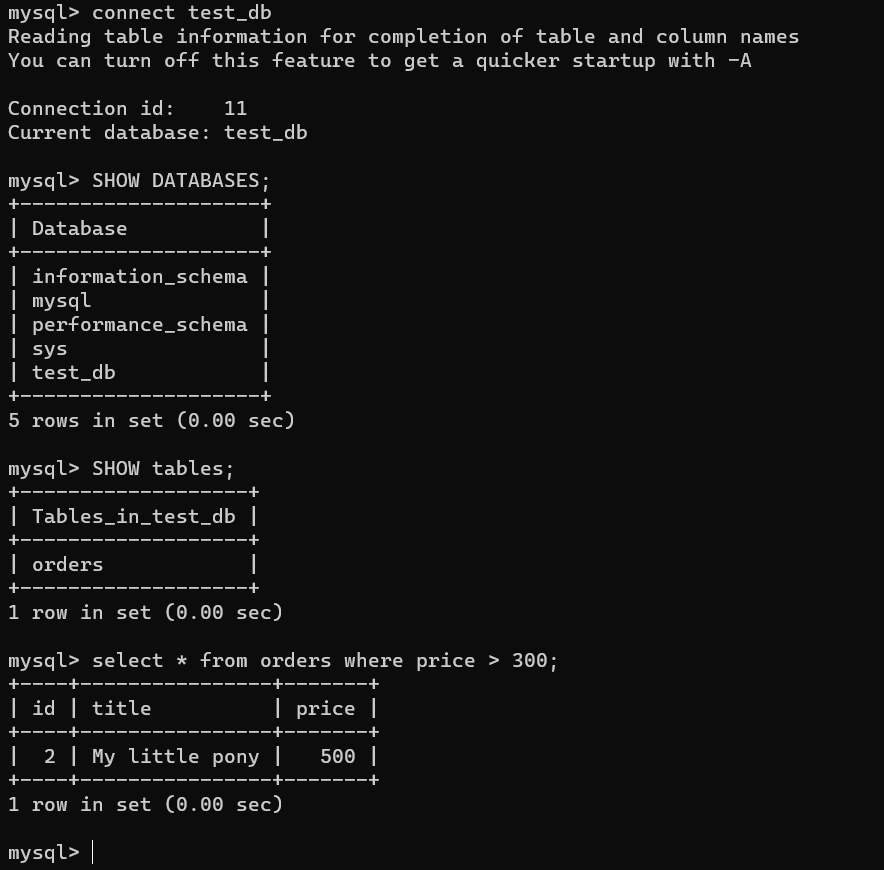

Задача 2

Создайте пользователя test в БД c паролем test-pass, используя:

плагин авторизации mysql_native_password
срок истечения пароля — 180 дней
количество попыток авторизации — 3
максимальное количество запросов в час — 100
аттрибуты пользователя:
Фамилия "Pretty"
Имя "James".
Предоставьте привелегии пользователю test на операции SELECT базы test_db.

Используя таблицу INFORMATION_SCHEMA.USER_ATTRIBUTES, получите данные по пользователю test и приведите в ответе к задаче.

Ответ:

1.Создаём пользователя с заданными параметрами

    mysql> CREATE USER 'test'@'localhost'

    -> IDENTIFIED WITH mysql_native_password BY 'test-pass'

    -> WITH MAX_QUERIES_PER_HOUR 100

    -> PASSWORD EXPIRE INTERVAL 180 DAY

    -> FAILED_LOGIN_ATTEMPTS 3

    -> ATTRIBUTE '{"fname": "James", "lname": "Pretty"}';

2.Предоставьте привелегии пользователю

    GRANT SELECT ON test_db.* TO 'test'@'localhost';

3.Данные по пользователю test

    SELECT * FROM INFORMATION_SCHEMA.USER_ATTRIBUTES WHERE USER = 'test' AND HOST = 'localhost';

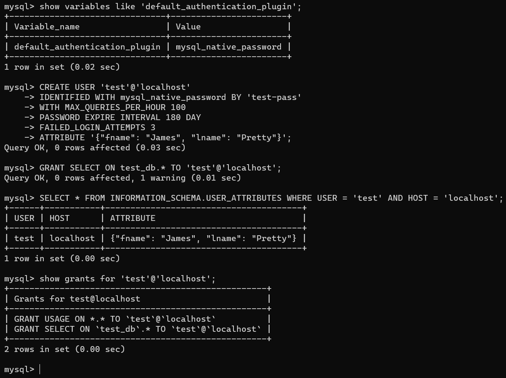

Задача 3

Установите профилирование SET profiling = 1. Изучите вывод профилирования команд SHOW PROFILES;.

Исследуйте, какой engine используется в таблице БД test_db и приведите в ответе.

Измените engine и приведите время выполнения и запрос на изменения из профайлера в ответе:

на MyISAM,
на InnoDB.

Ответ:

1.Устанавливаем профилирование

    set profiling = 1;

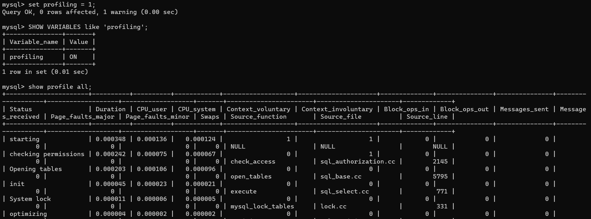

2.Смотрим текущий поисковый движок

    SHOW VARIABLES like 'default_storage_engine';

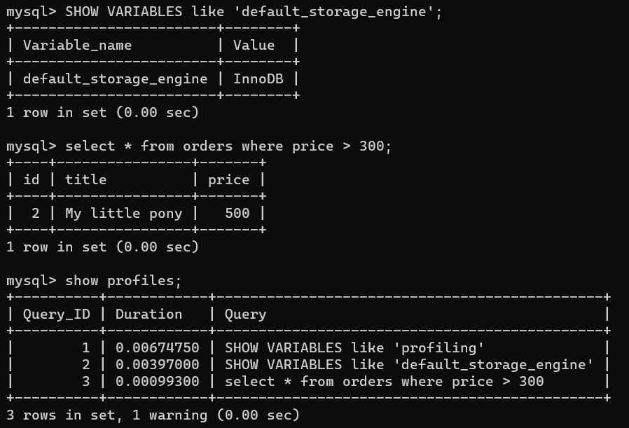

3.Меняем поисковый движок и сравним время выполения. На скриншоте ниже видно, что после смены движка время выполнения увеличилось, значение столбца Duration для строки 5 больше строки 3.

    alter table orders engine = MyISAM;

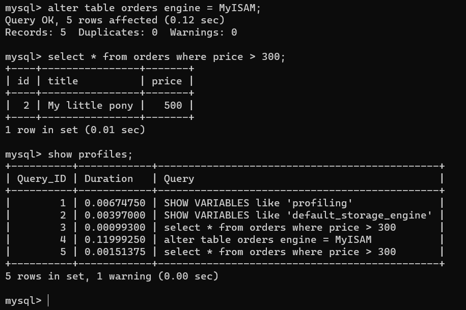

Задача 4

Изучите файл my.cnf в директории /etc/mysql.

Измените его согласно ТЗ (движок InnoDB):

скорость IO важнее сохранности данных;
нужна компрессия таблиц для экономии места на диске;
размер буффера с незакомиченными транзакциями 1 Мб;
буффер кеширования 30% от ОЗУ;
размер файла логов операций 100 Мб.
Приведите в ответе изменённый файл my.cnf.

Ответ:

Доступная память на виртуальном хосте 2 гб, они все доступны контейнеру, 30% это 614 мб. 

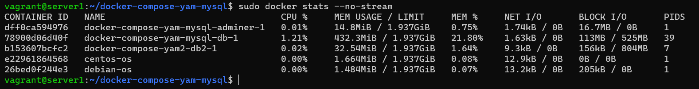

Измененный файл [my.cnf](https://github.com/VitaliyW88/devops-netology/blob/78dc8dc7869044b92eb7bfc8621781ed1df35e9b/Files/my.cnf)