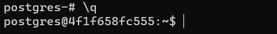

Задача 1

Используя Docker, поднимите инстанс PostgreSQL (версию 13). Данные БД сохраните в volume.

Подключитесь к БД PostgreSQL, используя psql.

Воспользуйтесь командой \? для вывода подсказки по имеющимся в psql управляющим командам.

Найдите и приведите управляющие команды для:

    вывода списка БД,
    подключения к БД,
    вывода списка таблиц,
    вывода описания содержимого таблиц,
    выхода из psql.

Ответ:

1.Создадим docker-compose файл.

2.Создадим сервис, запустим его, подключимся к контейнеру и psql.

3.Вывод списка БД.

    \l+ *

4.Подключение к БД.

    \connect postgres;

5.Вывод списка таблиц.

    \dtS+

6.Вывод описания содержимого таблиц.

    \dS+ pg_user_mapping

7.Выход из psql.

    \q

Задача 2

Используя psql, создайте БД test_database.

Изучите бэкап БД.

Восстановите бэкап БД в test_database.

Перейдите в управляющую консоль psql внутри контейнера.

Подключитесь к восстановленной БД и проведите операцию ANALYZE для сбора статистики по таблице.

Используя таблицу pg_stats, найдите столбец таблицы orders с наибольшим средним значением размера элементов в байтах.

Приведите в ответе команду, которую вы использовали для вычисления, и полученный результат.

Ответ:

1.Присвоим права на папки для пользователя postgres.

    chown postgres:postgres /var/db-data/

    chown postgres:postgres /var/db-backup/

2.Копируем бэкап БД в докер, создадим бд в контейнере и загрузим backup.

    CREATE TABLESPACE "test-tablespace" OWNER CURRENT_USER LOCATION '/var/db-data';

    CREATE DATABASE "test_database" WITH TABLESPACE = "test-tablespace";

    $ psql --dbname=test_database --file=test_dump.sql

3.Подключаемся к восстановленной БД и проводим операцию ANALYZE. Используем select для выбора максимального значения.

    \connect test_database;

    analyze;

    select max(avg_width),attname from pg_stats where tablename ='orders' group by attname;

Задача 3

Архитектор и администратор БД выяснили, что ваша таблица orders разрослась до невиданных размеров и поиск по ней занимает долгое время. Вам как успешному выпускнику курсов DevOps в Нетологии предложили провести разбиение таблицы на 2: шардировать на orders_1 - price>499 и orders_2 - price<=499.

Предложите SQL-транзакцию для проведения этой операции.

Можно ли было изначально исключить ручное разбиение при проектировании таблицы orders?

Ответ:

Задача 4

Используя утилиту pg_dump, создайте бекап БД test_database.

Как бы вы доработали бэкап-файл, чтобы добавить уникальность значения столбца title для таблиц test_database?

Ответ: